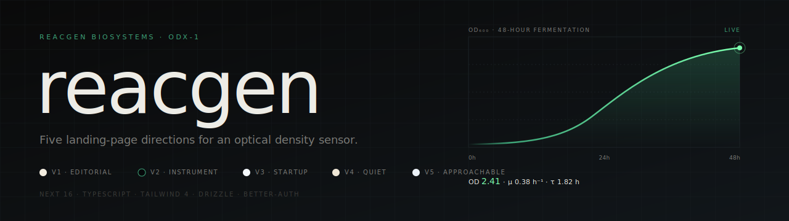

<p align="center">
  
</p>

<p align="center">
  <a href="#"></a>
  <a href="#"></a>
  <a href="#"></a>
  <a href="#"></a>
</p>

---

Five concurrent landing-page directions for the **ODX-1 optical density sensor** — same product story, five readers, five typographic voices.

## The five directions

| | route | tone | palette |
|---|---|---|---|
| **v1** | [`/v1`](src/app/v1) | Editorial · scientific journal | sand, ink, viridian |
| **v2** | [`/v2`](src/app/v2) | Instrument · engineer-to-engineer | jet, mint, neon |
| **v3** | [`/v3`](src/app/v3) | Startup · pale blue, scrappy | ice, navy, sun |
| **v4** | [`/v4`](src/app/v4) | Quiet · monochrome warm | clay, umber, dune |
| **v5** | [`/v5`](src/app/v5) | Approachable instrument · v2 content in v3 voice (only dark-mode toggle) | mist, navy, sun |

The index at [`/`](src/app/page.tsx) shows all five side-by-side.

## Run it

```bash
pnpm install
pnpm dev
```

## Stack

`Next 16` · `React 19` · `TypeScript` · `Tailwind 4` · `Drizzle ORM` · `better-auth`
